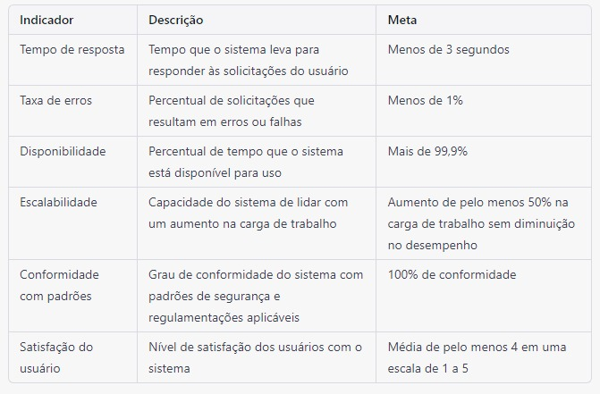
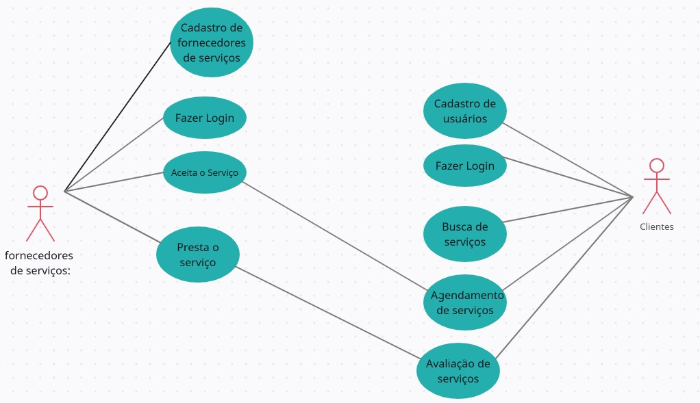
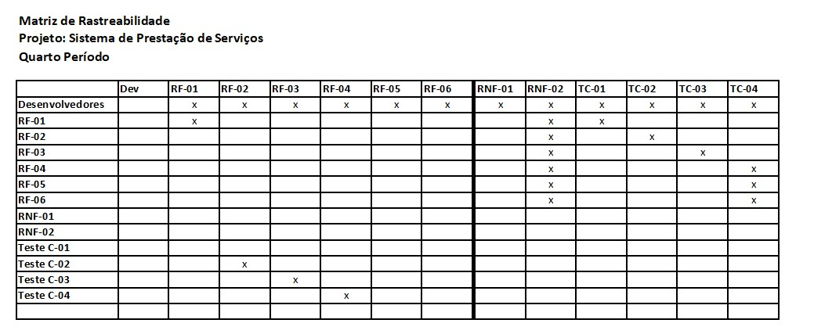
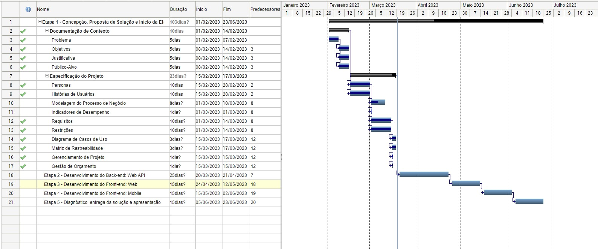
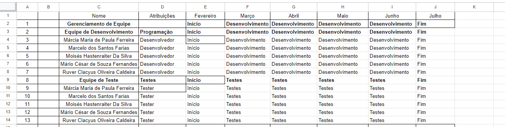
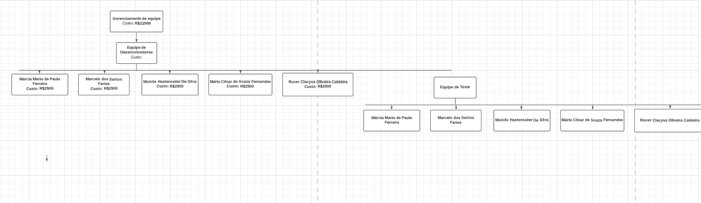
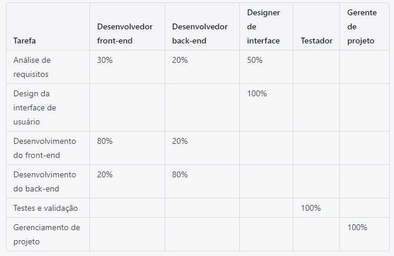
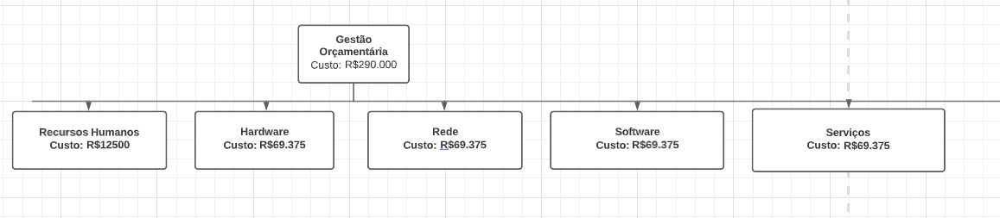

# Especificações do Projeto

È possível definir o problema de forma mais específica a partir da perspectiva do usuário. Por exemplo, a persona Ana, solteira que trabalha em tempo integral, enfrenta dificuldades em encontrar tempo e energia para lidar com a manutenção da sua casa. Ana precisa de serviços diversos em sua residência, mas muitas vezes não sabe a quem recorrer ou não tem confiança nos profissionais disponíveis em sua região.

Já a persona Maria, uma mulher aposentada que mora sozinha, pode enfrentar problemas semelhantes. Ela tem mais tempo disponível do que Ana, mas pode ter dificuldades físicas para lidar com certos serviços de manutenção em sua casa, como consertos de encanamento ou limpeza de ar-condicionado. Além disso, Maria pode ser mais receosa em relação à contratação de profissionais desconhecidos.

A ideia de solução proposta pela aplicação é oferecer uma plataforma digital conveniente e prática para conectar usuários como Ana e Maria a profissionais qualificados e reconhecidos em sua região. Os usuários podem buscar os serviços que precisam na plataforma e encontrar profissionais de confiança, com avaliações e feedbacks de outros usuários. Dessa forma, a aplicação ajuda a reduzir a incerteza e a insegurança que muitos usuários enfrentam ao contratar profissionais desconhecidos.

Para os fornecedores de serviços, a aplicação pode oferecer uma oportunidade de expandir seus negócios e encontrar novos clientes em sua região, aumentando assim sua visibilidade e lucratividade. A aplicação também pode ajudar a reduzir a complexidade da busca por novos clientes, permitindo que os fornecedores se concentrem em fornecer serviços de alta qualidade para seus clientes existentes.

## Personas

## Persona 1 Nome: Ana Silva

- Idade: 35 anos
- Ocupação: Empresária.

 Ana é uma mulher ocupada, que tem pouco tempo para cuidar da casa e precisa se concentrar em sua carreira e em seus filhos.
Ela precisa de um profissional qualificado e confiável para consertar a torneira que está vazando na cozinha.
Ana acessa o aplicativo, pesquisa por serviços de encanamento em sua região, verifica as avaliações de outros usuários e agenda uma visita do prestador de serviços para o dia seguinte.
O prestador de serviços chega no horário marcado, realiza o conserto com rapidez e eficiência, e Ana paga pelo serviço diretamente pelo aplicativo.

## Persona 2 Nome: João Cardoso

- Idade: 28 anos 
- Ocupação: Estudante universitário.

João é um jovem que acabou de se mudar para um apartamento alugado e precisa de um dinheiro extra para ajudar nas despesas com os estudos.
Ele acessa o aplicativo e verifica as notificações para o(s) seviço(s) ao(s) qual(is) se cadatrou.
Por ser bem qualificado e pontual é sempre bem alaliado na plataforma.

## Persona 3 Nome: Maria Nunes

- Idade: 60 anos
- Ocupação: Aposentada.

Maria é uma senhora que mora sozinha e precisa de ajuda para realizar algumas tarefas domésticas, como limpeza e jardinagem.
Ela acessa o aplicativo, pesquisa por serviços de limpeza e jardinagem em sua região, seleciona o prestador de serviços mais bem avaliado e agenda uma visita para o próximo sábado.
O prestador de serviços chega no horário marcado, realiza a limpeza da casa e do jardim com cuidado e eficiência, e Maria fica muito satisfeita com o resultado.
Ela avalia positivamente o serviço prestado e paga pelo serviço diretamente pelo aplicativo, com segurança e praticidade.

## Histórias de Usuários

Com base na análise das personas forma identificadas as seguintes histórias de usuários:

|EU COMO... `PERSONA`| QUERO/PRECISO ... `FUNCIONALIDADE` |PARA ... `MOTIVO/VALOR`                 |
|--------------------|------------------------------------|----------------------------------------|
|Ana Silva       |Desejo uma ferramenta para encontrar prestadores de serviços de Para solucionar um problema na instalação Hidráulica |Ana é uma mulher ocupada, que tem pouco tempo para cuidar da casa e precisa se concentrar em sua carreira e em seus filhos. Ela precisa de um profissional qualificado e confiável para consertar a torneira que está vazando na cozinha. |
|João Cardoso    |Desejo uma ferramenta para encontrar prestadores de serviços de montagem de móveis e instalação de ar-condicionado em sua região|João é um jovem que acabou de se mudar para um apartamento alugado e precisa de ajuda para montar seus móveis e instalar o ar-condicionado. |
|Maria Nunes     |Desejo uma ferramenta para encontrar prestadores de serviços de  limpeza e jardinagem em sua região|Maria é uma senhora que mora sozinha e precisa de ajuda para realizar algumas tarefas domésticas, como limpeza e jardinagem. |

## Modelagem do Processo de Negócio 

### Análise da Situação Atual

Nos dias de hoje, a busca por profissionais para prestação de serviços com qualidade e rapidez pode ser uma tarefa desafiadora. Nesse sentido, uma aplicação para conectar clientes e profissionais pode ser uma excelente solução para otimizar e agilizar esse processo.

Com a aplicação, é possível que o cliente solicite serviços de forma mais prática e personalizada, especificando suas necessidades e recebendo indicações de profissionais qualificados. A aplicação pode permitir que o cliente visualize o perfil do profissional, suas habilidades e qualificações, bem como as avaliações de outros clientes que já utilizaram seus serviços.

Além disso, a aplicação pode oferecer funcionalidades como agendamento de horários, pagamento online e acompanhamento do serviço prestado, tudo de forma integrada e prática. Isso permite que o cliente tenha maior controle sobre o serviço contratado, e que o profissional possa prestar um serviço de qualidade com mais eficiência e rapidez.

Outro benefício de uma aplicação para conectar clientes e profissionais é a possibilidade de fidelizar clientes e criar novas oportunidades de negócios para os profissionais cadastrados. A aplicação pode oferecer programas de fidelidade e recompensas para clientes que utilizam o serviço com frequência, bem como oportunidades de crescimento e qualificação para os profissionais que prestam serviços de qualidade.

Por fim, a criação de uma aplicação para conectar clientes e profissionais também pode ser vista como uma oportunidade de inovação e diferenciação no mercado. Empresas que oferecem uma solução eficaz e inovadora para conectar clientes e profissionais tendem a ter uma vantagem competitiva e a atrair mais negócios.

 

### Descrição Geral da Proposta

A modelagem do processo de negócio da aplicação pode ser representada pelo seguinte diagrama de fluxo de processo:

-1. Cadastro de fornecedores de serviços: os fornecedores de serviços devem poder se cadastrar no aplicativo, fornecendo informações como nome, endereço, telefone, e-mail, especialidades, entre outras.

-2. Cadastro de Usuário: o processo se inicia com o cadastro do usuário no aplicativo, informando nome completo, endereço, e-mail e senha.

-3. Busca de Serviços: o usuário pode buscar por serviços disponíveis no aplicativo, informando sua localização e tipo de serviço desejado.

-4. Seleção de Prestador: após a busca, o usuário pode selecionar um prestador de serviços a partir das informações disponíveis no aplicativo, como avaliações de outros usuários, fotos e descrição dos serviços prestados.

-5. Solicitação de Serviço: o usuário pode solicitar o serviço selecionado pelo prestador de serviços, informando o dia e horário desejados para o atendimento.

-6. Confirmação do Serviço: o prestador de serviços recebe a solicitação do usuário e pode confirmar ou não a prestação do serviço, informando o dia e horário para o atendimento.

-7.  Atendimento ao Usuário: o prestador de serviços comparece ao endereço indicado pelo usuário e realiza o serviço solicitado.

-8.  Avaliação do Serviço: após o atendimento, o usuário pode avaliar o serviço prestado pelo prestador, atribuindo uma nota e um comentário.

-9. Pagamento do Serviço: o usuário pode realizar o pagamento do serviço prestado pelo prestador diretamente pelo aplicativo.

-10. Registro do Pagamento: após o pagamento, o aplicativo registra a transação e envia um comprovante de pagamento para o usuário e para o prestador de serviços.

-11. Fim do Processo: com a conclusão do pagamento, o processo é finalizado.

### Processo 1 – CADASTRO DE USUÁRIOS

## Indicadores de Desempenho

Com base nos indicadores de desempenho apresentados na matriz, aqui estão alguns argumentos técnicos que podem ser usados para avaliar o desempenho do software:

- Tempo de resposta: Um tempo de resposta rápido é importante para garantir uma boa experiência do usuário e aumentar a eficiência da interação com o sistema. Além disso, uma resposta rápida pode ser essencial em cenários críticos, como transações financeiras ou processos de emergência.

- Taxa de erros: Uma taxa de erros baixa indica que o software é robusto e confiável, resultando em menos interrupções no fluxo de trabalho do usuário e menor necessidade de suporte técnico. Também é importante lembrar que erros em algumas áreas do software, como a segurança, podem ter consequências graves para a organização.

- Disponibilidade: O software deve estar disponível quando necessário para garantir que as tarefas possam ser realizadas e os prazos cumpridos. Uma baixa disponibilidade pode causar perda de produtividade, insatisfação do usuário e possivelmente impactar negativamente o negócio como um todo.

- Escalabilidade: Um software escalável é importante para lidar com a expansão dos negócios ou um aumento na carga de trabalho. Sem escalabilidade, o desempenho pode diminuir drasticamente, resultando em uma experiência ruim do usuário e possivelmente perda de receita.

- Conformidade com padrões: O cumprimento de padrões de segurança e regulamentações é importante para proteger a organização e seus usuários de ameaças externas e garantir conformidade legal. A falha em atender a esses padrões pode resultar em multas, perda de confiança do cliente e perda de negócios.

- Satisfação do usuário: A satisfação do usuário é um indicador importante do valor que o software oferece para a organização. Um alto nível de satisfação do usuário pode resultar em maior produtividade, menor rotatividade de funcionários e, potencialmente, maior receita. Além disso, a insatisfação do usuário pode ser um indicador de problemas em outros indicadores, como tempo de resposta ou taxa de erros. 

seguinte modelo: 

## Requisitos

As tabelas que se seguem apresentam os requisitos funcionais e não funcionais que detalham o escopo do projeto. Para determinar a prioridade de requisitos, aplicar uma técnica de priorização de requisitos e detalhar como a técnica foi aplicada.

### Requisitos Funcionais

|  ID  | Descrição do Requisito  | Prioridade |
|------|-----------------------------------------|----|
|RF-001|Cadastro de fornecedores de serviços: Os fornecedores de serviços devem poder se cadastrar no aplicativo, fornecendo informações como nome, endereço, telefone, e-mail, especialidades, entre outras.| ALTA | 
|RF-002|Fazer login: Os fornecedores de serviços devem fazer login para acessar o aplicativo.| ALTA | 
|RF-003|Cadastro de usuários: Os usuários devem poder se cadastrar no aplicativo, fornecendo informações como nome, endereço, telefone, e-mail, entre outras.| ALTA |
|RF-004|Fazer login: Os usuarios devem fazer login para acessar o aplicativo.| ALTA |
|RF-005|Busca de serviços: Os usuários devem poder pesquisar serviços disponíveis na sua região, por tipo de serviço, especialidade, avaliação, entre outras opções.| ALTA |
|RF-006|Agendamento de serviços: Os usuários devem poder agendar serviços diretamente pelo aplicativo, escolhendo a data e horário mais convenientes.   | ALTA |
|RF-007|Aceitar: Os fornecedores de serviços devem ou nao aceitar a oferta de serviço| MÉDIA |
|RF-008|Avaliação de serviços: Os usuários devem poder avaliar os serviços prestados pelos fornecedores, ajudando outros usuários a escolherem o melhor prestador de serviços.| ALTA |

### Requisitos não Funcionais

|ID     | Descrição do Requisito  |Prioridade |
|-------|-------------------------|----|
|RNF-001|Usabilidade: o aplicativo deve ser fácil e intuitivo de usar, para que os usuários possam encontrar os serviços que precisam de forma rápida e eficiente. | Alta | 
|RNF-002|Desempenho: o aplicativo deve ser rápido e responsivo, mesmo quando muitos usuários estão acessando simultaneamente. | Alta |
|RNF-003|Confiabilidade: o aplicativo deve ser confiável e estar disponível 24 horas por dia, 7 dias por semana, para que os usuários possam acessá-lo sempre que precisarem. | Alta | 
|RNF-004|Segurança: o aplicativo deve ser seguro e proteger as informações pessoais e financeiras dos usuários. | Alta | 
|RNF-005|Escalabilidade: o aplicativo deve ser capaz de lidar com um grande número de usuários e fornecedores de serviços, sem comprometer o desempenho e a usabilidade. | Alta  | 

Com base nas Histórias de Usuário, enumere os requisitos da sua solução. Classifique esses requisitos em dois grupos:

- [Requisitos Funcionais
 (RF)](https://pt.wikipedia.org/wiki/Requisito_funcional):
 correspondem a uma funcionalidade que deve estar presente na
  plataforma (ex: cadastro de usuário).
- [Requisitos Não Funcionais
  (RNF)](https://pt.wikipedia.org/wiki/Requisito_n%C3%A3o_funcional):
  correspondem a uma característica técnica, seja de usabilidade,
  desempenho, confiabilidade, segurança ou outro (ex: suporte a
  dispositivos iOS e Android).
Lembre-se que cada requisito deve corresponder à uma e somente uma
característica alvo da sua solução. Além disso, certifique-se de que
todos os aspectos capturados nas Histórias de Usuário foram cobertos.

## Restrições

O projeto está restrito pelos itens apresentados na tabela a seguir.

|ID| Restrição                                             |
|--|-------------------------------------------------------|
|01| O projeto deverá ser entregue até o final do semestre |
|02| Não pode ser desenvolvido um módulo de backend        |

Enumere as restrições à sua solução. Lembre-se de que as restrições geralmente limitam a solução candidata.

> **Links Úteis**:
> - [O que são Requisitos Funcionais e Requisitos Não Funcionais?](https://codificar.com.br/requisitos-funcionais-nao-funcionais/)
> - [O que são requisitos funcionais e requisitos não funcionais?](https://analisederequisitos.com.br/requisitos-funcionais-e-requisitos-nao-funcionais-o-que-sao/)

## Diagrama de Casos de Uso

O diagrama de casos de uso é o próximo passo após a elicitação de requisitos, que utiliza um modelo gráfico e uma tabela com as descrições sucintas dos casos de uso e dos atores. Ele contempla a fronteira do sistema e o detalhamento dos requisitos funcionais com a indicação dos atores, casos de uso e seus relacionamentos. 

# Matriz de Rastreabilidade

A matriz de rastreabilidade é uma ferramenta usada para facilitar a visualização dos relacionamento entre requisitos e outros artefatos ou objetos, permitindo a rastreabilidade entre os requisitos e os objetivos de negócio. 

A matriz deve contemplar todos os elementos relevantes que fazem parte do sistema, conforme a figura meramente ilustrativa apresentada a seguir.

# Gerenciamento de Projeto

De acordo com o PMBoK v6 as dez áreas que constituem os pilares para gerenciar projetos, e que caracterizam a multidisciplinaridade envolvida, são: Integração, Escopo, Cronograma (Tempo), Custos, Qualidade, Recursos, Comunicações, Riscos, Aquisições, Partes Interessadas. Para desenvolver projetos um profissional deve se preocupar em gerenciar todas essas dez áreas. Elas se complementam e se relacionam, de tal forma que não se deve apenas examinar uma área de forma estanque. É preciso considerar, por exemplo, que as áreas de Escopo, Cronograma e Custos estão muito relacionadas. Assim, se eu amplio o escopo de um projeto eu posso afetar seu cronograma e seus custos.

## Gerenciamento de Tempo

O gráfico de Gantt ou diagrama de Gantt também é uma ferramenta visual utilizada para controlar e gerenciar o cronograma de atividades de um projeto. Com ele, é possível listar tudo que precisa ser feito para colocar o projeto em prática, dividir em atividades e estimar o tempo necessário para executá-las.

## Gerenciamento de Equipe

A matriz de gerenciamento de equipe  mostra as principais tarefas do projeto e como a equipe será alocada para cada tarefa. As porcentagens mostram a distribuição de tempo de cada recurso em cada tarefa.

Por exemplo, na tarefa "Análise de requisitos", espera-se que o desenvolvedor front-end contribua com 30% do tempo, o desenvolvedor back-end com 20% do tempo e o designer de interface com 50% do tempo.

Isso ajuda a garantir que cada membro da equipe seja alocado para tarefas que melhor se adaptem às suas habilidades e experiências, e garante que cada tarefa receba a atenção adequada de recursos qualificados.

Lembrando que essa é apenas uma estimativa de como a equipe pode ser alocada para cada tarefa, e que a alocação real pode variar dependendo da disponibilidade e desempenho da equipe. 

## Gestão de Orçamento

A matriz de orçamento mostra as principais tarefas do projeto, os recursos necessários para cada tarefa, o custo por hora de cada recurso, as horas necessárias para cada tarefa e o custo total de cada tarefa. O total de todas as tarefas é apresentado no final da tabela.

É importante lembrar que essa é apenas uma estimativa de custos e que os custos reais podem variar dependendo de vários fatores, como a complexidade do projeto, o número de recursos necessários, o tempo necessário para cada tarefa e outros fatores que podem influenciar o custo final do projeto.

