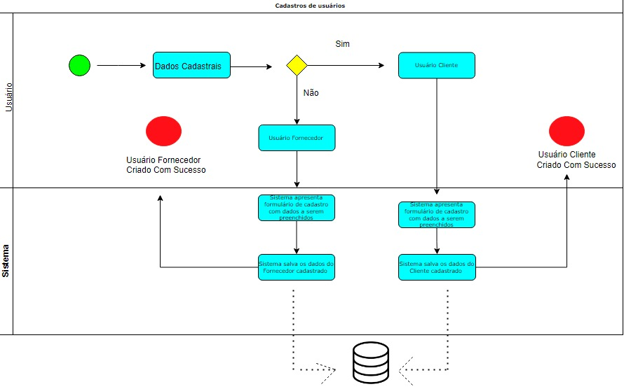

# Especificações do Projeto

È possível definir o problema de forma mais específica a partir da perspectiva do usuário. Por exemplo, a persona Ana, uma mãe solteira que trabalha em tempo integral, enfrenta dificuldades em encontrar tempo e energia para lidar com a manutenção da sua casa. Ana precisa de serviços diversos em sua residência, mas muitas vezes não sabe a quem recorrer ou não tem confiança nos profissionais disponíveis em sua região.

Já a persona Maria, uma mulher aposentada que mora sozinha, pode enfrentar problemas semelhantes. Ela tem mais tempo disponível do que Ana, mas pode ter dificuldades físicas para lidar com certos serviços de manutenção em sua casa, como consertos de encanamento ou limpeza de ar-condicionado. Além disso, Maria pode ser mais receosa em relação à contratação de profissionais desconhecidos.

A ideia de solução proposta pela aplicação é oferecer uma plataforma digital conveniente e prática para conectar usuários como Ana e Maria a profissionais qualificados e reconhecidos em sua região. Os usuários podem buscar os serviços que precisam na plataforma e encontrar profissionais de confiança, com avaliações e feedbacks de outros usuários. Dessa forma, a aplicação ajuda a reduzir a incerteza e a insegurança que muitos usuários enfrentam ao contratar profissionais desconhecidos.

Para os fornecedores de serviços, a aplicação pode oferecer uma oportunidade de expandir seus negócios e encontrar novos clientes em sua região, aumentando assim sua visibilidade e lucratividade. A aplicação também pode ajudar a reduzir a complexidade da busca por novos clientes, permitindo que os fornecedores se concentrem em fornecer serviços de alta qualidade para seus clientes existentes.

## Personas

## Persona 1 Nome: Ana Silva

- Idade: 35 anos
- Ocupação: Empresária.

 Ana é uma mulher ocupada, que tem pouco tempo para cuidar da casa e precisa se concentrar em sua carreira e em seus filhos.
Ela precisa de um profissional qualificado e confiável para consertar a torneira que está vazando na cozinha.
Ana acessa o aplicativo, pesquisa por serviços de encanamento em sua região, verifica as avaliações de outros usuários e agenda uma visita do prestador de serviços para o dia seguinte.
O prestador de serviços chega no horário marcado, realiza o conserto com rapidez e eficiência, e Ana paga pelo serviço diretamente pelo aplicativo.

## Persona 2 Nome: João Cardoso

- Idade: 28 anos 
- Ocupação: Estudante universitário.
João é um jovem que acabou de se mudar para um apartamento alugado e precisa de ajuda para montar seus móveis e instalar o ar-condicionado.
Ele acessa o aplicativo, pesquisa por serviços de montagem de móveis e instalação de ar-condicionado em sua região, seleciona o prestador de serviços mais bem avaliado e agenda uma visita para o final de semana.
O prestador de serviços chega no horário marcado, monta todos os móveis de João com rapidez e habilidade, e instala o ar-condicionado sem nenhum problema.
João avalia positivamente o serviço prestado e paga pelo serviço diretamente pelo aplicativo, com segurança e praticidade.

## Persona 3 Nome: Maria

- Idade: 60 anos
- Ocupação: Aposentada.
Maria é uma senhora que mora sozinha e precisa de ajuda para realizar algumas tarefas domésticas, como limpeza e jardinagem.
Ela acessa o aplicativo, pesquisa por serviços de limpeza e jardinagem em sua região, seleciona o prestador de serviços mais bem avaliado e agenda uma visita para o próximo sábado.
O prestador de serviços chega no horário marcado, realiza a limpeza da casa e do jardim com cuidado e eficiência, e Maria fica muito satisfeita com o resultado.
Ela avalia positivamente o serviço prestado e paga pelo serviço diretamente pelo aplicativo, com segurança e praticidade.

## Persona 4 Nome: Rafael Oliveira

- Idade: 40 anos
- Ocupação: Empresário.
Rafael é um homem ocupado, que viaja com frequência a trabalho e precisa de uma pessoa de confiança para cuidar de sua casa e de seus animais de estimação quando está ausente.
Ele acessa o aplicativo, pesquisa por serviços de cuidador de animais e de casa em sua região, verifica as avaliações de outros usuários e encontra um prestador de serviços que se encaixa em suas necessidades.
O prestador de serviços visita a casa de Rafael antes de sua próxima viagem, para conhecer os animais e as tarefas a serem realizadas, e fica responsável por cuidar da casa e dos animais enquanto ele está fora.
Rafael avalia positivamente o serviço prestado e paga pelo serviço diretamente pelo aplicativo, com segurança e praticidade.

## Persona 5 Nome: Tiago Alves

- Idade: 25 anos
- Ocupação: Estudante universitário.
Tiago é um jovem que mora em uma república com outros estudantes e precisa de um profissional qualificado para consertar a máquina de lavar que está quebrada.
Ele acessa o aplicativo, pesquisa por serviços de manutenção de eletrodomésticos em sua região, verifica as avaliações de outros usuários e encontra um prestador de serviços com experiência nesse tipo de reparo.
O prestador de serviços chega no horário marcado, analisa a máquina de lavar e consegue consertá-la rapidamente, sem nenhum problema.
Tiago avalia positivamente o serviço prestado e paga pelo serviço diretamente pelo aplicativo, com segurança e praticidade.

As histórias de usuário acima demonstram como a aplicação pode ajudar pessoas de diferentes perfis e necessidades a encontrarem profissionais qualificados e confiáveis para realizar serviços de manutenção e reparos em suas casas, de forma rápida, fácil e segura.

Enumere e detalhe as personas da sua solução. Para tanto, baseie-se tanto nos documentos disponibilizados na disciplina e/ou nos seguintes links:

> **Links Úteis**:
> - [Rock Content](https://rockcontent.com/blog/personas/)
> - [Hotmart](https://blog.hotmart.com/pt-br/como-criar-persona-negocio/)
> - [O que é persona?](https://resultadosdigitais.com.br/blog/persona-o-que-e/)
> - [Persona x Público-alvo](https://flammo.com.br/blog/persona-e-publico-alvo-qual-a-diferenca/)
> - [Mapa de Empatia](https://resultadosdigitais.com.br/blog/mapa-da-empatia/)
> - [Mapa de Stalkeholders](https://www.racecomunicacao.com.br/blog/como-fazer-o-mapeamento-de-stakeholders/)
>
Lembre-se que você deve ser enumerar e descrever precisamente e personalizada todos os clientes ideais que sua solução almeja.

## Histórias de Usuários

Com base na análise das personas forma identificadas as seguintes histórias de usuários:

|EU COMO... `PERSONA`| QUERO/PRECISO ... `FUNCIONALIDADE` |PARA ... `MOTIVO/VALOR`                 |
|--------------------|------------------------------------|----------------------------------------|
|Usuário do sistema  | Registrar minhas tarefas           | Não esquecer de fazê-las               |
|Administrador       | Alterar permissões                 | Permitir que possam administrar contas |

Apresente aqui as histórias de usuário que são relevantes para o projeto de sua solução. As Histórias de Usuário consistem em uma ferramenta poderosa para a compreensão e elicitação dos requisitos funcionais e não funcionais da sua aplicação. Se possível, agrupe as histórias de usuário por contexto, para facilitar consultas recorrentes à essa parte do documento.

> **Links Úteis**:
> - [Histórias de usuários com exemplos e template](https://www.atlassian.com/br/agile/project-management/user-stories)
> - [Como escrever boas histórias de usuário (User Stories)](https://medium.com/vertice/como-escrever-boas-users-stories-hist%C3%B3rias-de-usu%C3%A1rios-b29c75043fac)
> - [User Stories: requisitos que humanos entendem](https://www.luiztools.com.br/post/user-stories-descricao-de-requisitos-que-humanos-entendem/)
> - [Histórias de Usuários: mais exemplos](https://www.reqview.com/doc/user-stories-example.html)
> - [9 Common User Story Mistakes](https://airfocus.com/blog/user-story-mistakes/)

## Modelagem do Processo de Negócio 

### Análise da Situação Atual

Apresente aqui os problemas existentes que viabilizam sua proposta. Apresente o modelo do sistema como ele funciona hoje. Caso sua proposta seja inovadora e não existam processos claramente definidos, apresente como as tarefas que o seu sistema pretende implementar são executadas atualmente, mesmo que não se utilize tecnologia computacional. 

### Descrição Geral da Proposta

Apresente aqui uma descrição da sua proposta abordando seus limites e suas ligações com as estratégias e objetivos do negócio. Apresente aqui as oportunidades de melhorias.

### Processo 1 – NOME DO PROCESSO

Apresente aqui o nome e as oportunidades de melhorias para o processo 1. Em seguida, apresente o modelo do processo 1, descrito no padrão BPMN. 

### Processo 2 – NOME DO PROCESSO

Apresente aqui o nome e as oportunidades de melhorias para o processo 2. Em seguida, apresente o modelo do processo 2, descrito no padrão BPMN.

## Indicadores de Desempenho

Apresente aqui os principais indicadores de desempenho e algumas metas para o processo. Atenção: as informações necessárias para gerar os indicadores devem estar contempladas no diagrama de classe. Colocar no mínimo 5 indicadores. 

Usar o seguinte modelo: 

Obs.: todas as informações para gerar os indicadores devem estar no diagrama de classe a ser apresentado a posteriori. 

## Requisitos

As tabelas que se seguem apresentam os requisitos funcionais e não funcionais que detalham o escopo do projeto. Para determinar a prioridade de requisitos, aplicar uma técnica de priorização de requisitos e detalhar como a técnica foi aplicada.

### Requisitos Funcionais

|ID    | Descrição do Requisito  | Prioridade |
|------|-----------------------------------------|----|
|RF-001| Permitir que o usuário cadastre tarefas | ALTA | 
|RF-002| Emitir um relatório de tarefas no mês   | MÉDIA |

### Requisitos não Funcionais

|ID     | Descrição do Requisito  |Prioridade |
|-------|-------------------------|----|
|RNF-001| O sistema deve ser responsivo para rodar em um dispositivos móvel | MÉDIA | 
|RNF-002| Deve processar requisições do usuário em no máximo 3s |  BAIXA | 

Com base nas Histórias de Usuário, enumere os requisitos da sua solução. Classifique esses requisitos em dois grupos:

- [Requisitos Funcionais
 (RF)](https://pt.wikipedia.org/wiki/Requisito_funcional):
 correspondem a uma funcionalidade que deve estar presente na
  plataforma (ex: cadastro de usuário).
- [Requisitos Não Funcionais
  (RNF)](https://pt.wikipedia.org/wiki/Requisito_n%C3%A3o_funcional):
  correspondem a uma característica técnica, seja de usabilidade,
  desempenho, confiabilidade, segurança ou outro (ex: suporte a
  dispositivos iOS e Android).
Lembre-se que cada requisito deve corresponder à uma e somente uma
característica alvo da sua solução. Além disso, certifique-se de que
todos os aspectos capturados nas Histórias de Usuário foram cobertos.

## Restrições

O projeto está restrito pelos itens apresentados na tabela a seguir.

|ID| Restrição                                             |
|--|-------------------------------------------------------|
|01| O projeto deverá ser entregue até o final do semestre |
|02| Não pode ser desenvolvido um módulo de backend        |

Enumere as restrições à sua solução. Lembre-se de que as restrições geralmente limitam a solução candidata.

> **Links Úteis**:
> - [O que são Requisitos Funcionais e Requisitos Não Funcionais?](https://codificar.com.br/requisitos-funcionais-nao-funcionais/)
> - [O que são requisitos funcionais e requisitos não funcionais?](https://analisederequisitos.com.br/requisitos-funcionais-e-requisitos-nao-funcionais-o-que-sao/)

## Diagrama de Casos de Uso

O diagrama de casos de uso é o próximo passo após a elicitação de requisitos, que utiliza um modelo gráfico e uma tabela com as descrições sucintas dos casos de uso e dos atores. Ele contempla a fronteira do sistema e o detalhamento dos requisitos funcionais com a indicação dos atores, casos de uso e seus relacionamentos. 

As referências abaixo irão auxiliá-lo na geração do artefato “Diagrama de Casos de Uso”.

> **Links Úteis**:
> - [Criando Casos de Uso](https://www.ibm.com/docs/pt-br/elm/6.0?topic=requirements-creating-use-cases)
> - [Como Criar Diagrama de Caso de Uso: Tutorial Passo a Passo](https://gitmind.com/pt/fazer-diagrama-de-caso-uso.html/)
> - [Lucidchart](https://www.lucidchart.com/)
> - [Astah](https://astah.net/)
> - [Diagrams](https://app.diagrams.net/)

# Matriz de Rastreabilidade

A matriz de rastreabilidade é uma ferramenta usada para facilitar a visualização dos relacionamento entre requisitos e outros artefatos ou objetos, permitindo a rastreabilidade entre os requisitos e os objetivos de negócio. 

A matriz deve contemplar todos os elementos relevantes que fazem parte do sistema, conforme a figura meramente ilustrativa apresentada a seguir.

> **Links Úteis**:
> - [Artigo Engenharia de Software 13 - Rastreabilidade](https://www.devmedia.com.br/artigo-engenharia-de-software-13-rastreabilidade/12822/)
> - [Verificação da rastreabilidade de requisitos usando a integração do IBM Rational RequisitePro e do IBM ClearQuest Test Manager](https://developer.ibm.com/br/tutorials/requirementstraceabilityverificationusingrrpandcctm/)
> - [IBM Engineering Lifecycle Optimization – Publishing](https://www.ibm.com/br-pt/products/engineering-lifecycle-optimization/publishing/)

# Gerenciamento de Projeto

De acordo com o PMBoK v6 as dez áreas que constituem os pilares para gerenciar projetos, e que caracterizam a multidisciplinaridade envolvida, são: Integração, Escopo, Cronograma (Tempo), Custos, Qualidade, Recursos, Comunicações, Riscos, Aquisições, Partes Interessadas. Para desenvolver projetos um profissional deve se preocupar em gerenciar todas essas dez áreas. Elas se complementam e se relacionam, de tal forma que não se deve apenas examinar uma área de forma estanque. É preciso considerar, por exemplo, que as áreas de Escopo, Cronograma e Custos estão muito relacionadas. Assim, se eu amplio o escopo de um projeto eu posso afetar seu cronograma e seus custos.

## Gerenciamento de Tempo

Com diagramas bem organizados que permitem gerenciar o tempo nos projetos, o gerente de projetos agenda e coordena tarefas dentro de um projeto para estimar o tempo necessário de conclusão.

O gráfico de Gantt ou diagrama de Gantt também é uma ferramenta visual utilizada para controlar e gerenciar o cronograma de atividades de um projeto. Com ele, é possível listar tudo que precisa ser feito para colocar o projeto em prática, dividir em atividades e estimar o tempo necessário para executá-las.

## Gerenciamento de Equipe

O gerenciamento adequado de tarefas contribuirá para que o projeto alcance altos níveis de produtividade. Por isso, é fundamental que ocorra a gestão de tarefas e de pessoas, de modo que os times envolvidos no projeto possam ser facilmente gerenciados. 

## Gestão de Orçamento

O processo de determinar o orçamento do projeto é uma tarefa que depende, além dos produtos (saídas) dos processos anteriores do gerenciamento de custos, também de produtos oferecidos por outros processos de gerenciamento, como o escopo e o tempo.

