# Registro de Testes de Software

## Caso de Teste = 001 - Cadastro de Usuarios

### API-Serivicos
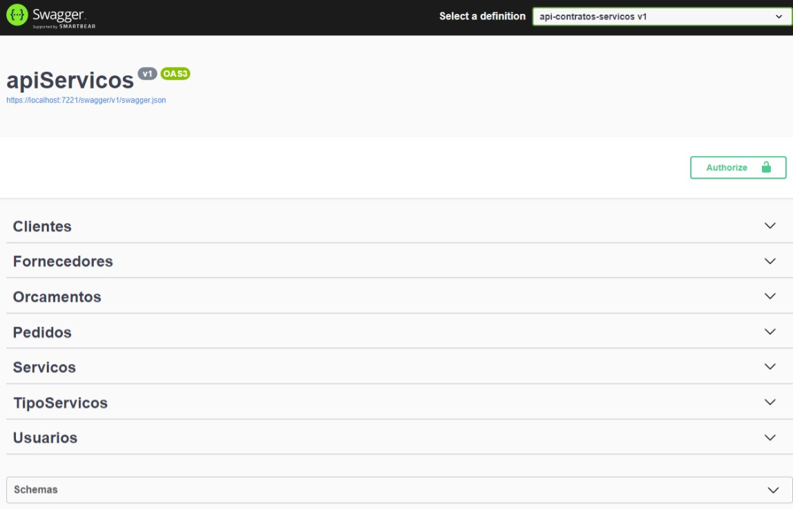

### API-Usuarios-Cadastrar
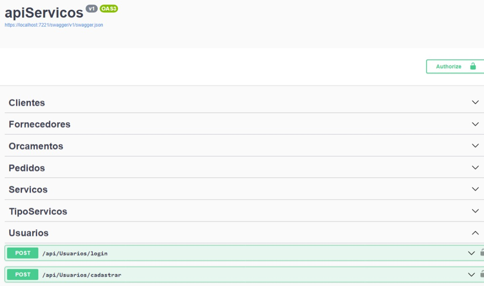

### API-Usuarios-Cadastrar-Preencher
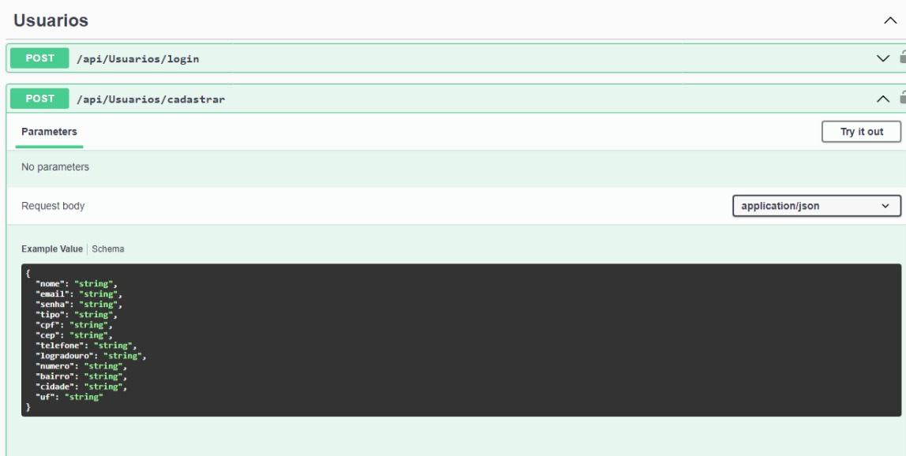

### API-Usuarios-Cadastrar-Com-Dados
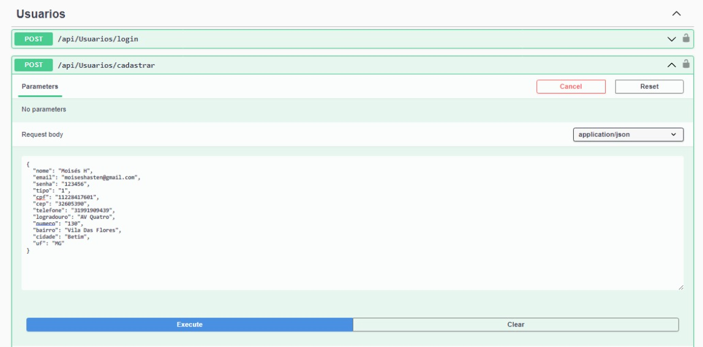

### API-Usuarios-Cadastrar-Resposta
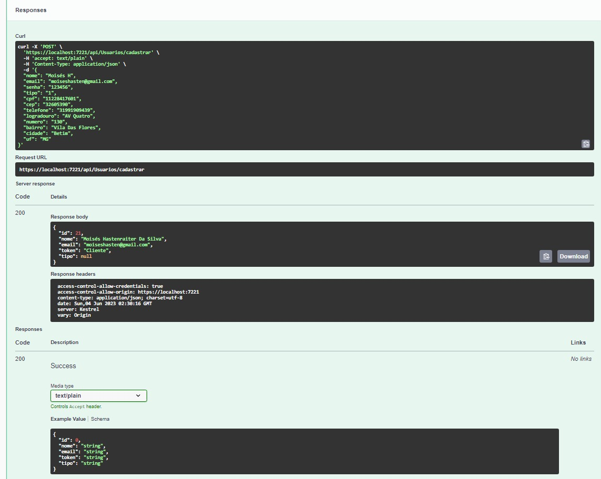

## Avaliação
O caso de teste 001 - Cadastro de Usuários foi realizado com sucesso, retornando o código de status HTTP 200.

Durante o teste, foram utilizadas diversas APIs relacionadas ao serviço de cadastro de usuários. A imagem "API-Serivicos" representa a visão geral desses serviços.

A primeira etapa do teste envolveu a API "API-Usuarios-Cadastrar", que é responsável por iniciar o processo de cadastro. A imagem "API-Usuarios-Cadastrar-Preencher" mostra o formulário utilizado para preencher os dados necessários.

Em seguida, utilizamos a API "API-Usuarios-Cadastrar-Com-Dados" para enviar os dados preenchidos anteriormente. A imagem correspondente, "API-Usuarios-Cadastrar-Com-Dados", apresenta os detalhes dessa etapa.

Por fim, recebemos a resposta da API em questão, conforme mostrado na imagem "API-Usuarios-Cadastrar-Resposta". Essa resposta confirma o sucesso do cadastro, uma vez que o código de status 200 foi retornado.

Esses testes demonstram que o processo de cadastro de usuários está funcionando conforme esperado, permitindo que novos usuários sejam registrados com sucesso no sistema.

## Caso de Teste = 002 - Login

### API-Serivicos

### Usuarios-Login-Preencher
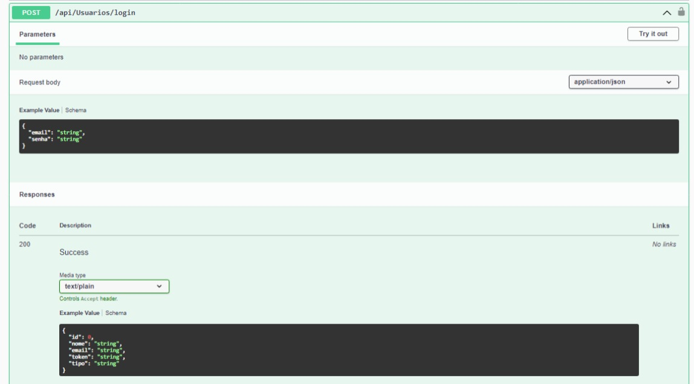

### API-Usuarios-Login-Com-Dados
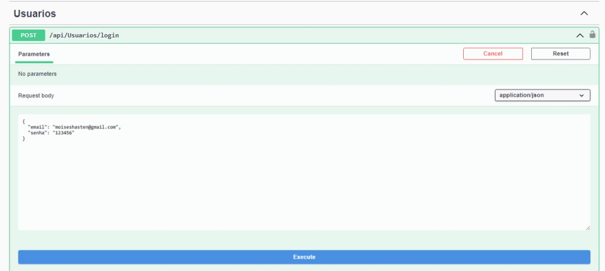

### API-Usuarios-Login-Resposta
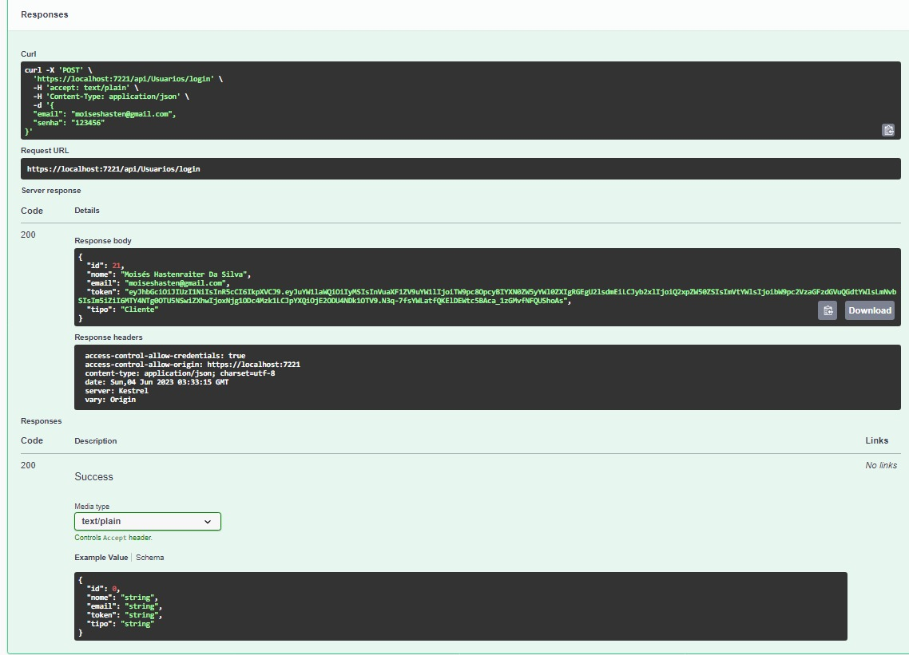

## Avaliação
Os casos de teste 002 - Fazer login e 002 - Login foram realizados com êxito, retornando o código de status HTTP 200.

Durante os testes, foram utilizadas as seguintes APIs relacionadas ao login de usuários. A imagem "API-Servicos" mostra uma visão geral desses serviços.

O primeiro passo consistiu em preencher os dados de login na API "Usuarios-Login-Preencher", conforme mostrado na imagem correspondente.

Em seguida, utilizamos a API "API-Usuarios-Login-Com-Dados" para enviar os dados preenchidos. A imagem "API-Usuarios-Login-Com-Dados" apresenta detalhes dessa etapa.

Por fim, recebemos a resposta da API, como mostrado na imagem "API-Usuarios-Login-Resposta". Essa resposta confirma o sucesso do login, uma vez que o código de status 200 foi retornado.

Esses testes demonstram que o processo de login de usuários está funcionando conforme esperado, permitindo que os usuários ingressem no sistema com suas credenciais corretas.

## Caso de Teste = 003 - (Banco De Dados Criptografia Senha Usuarios)

### Conectar ao Banco De Dados
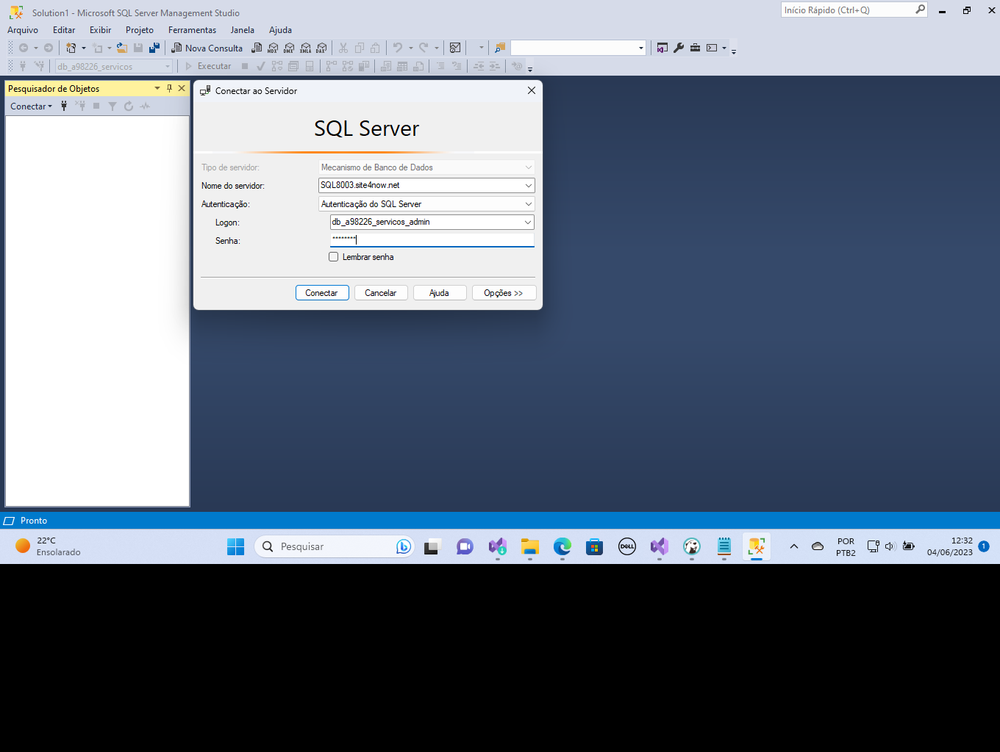

### Conectado ao banco de dados
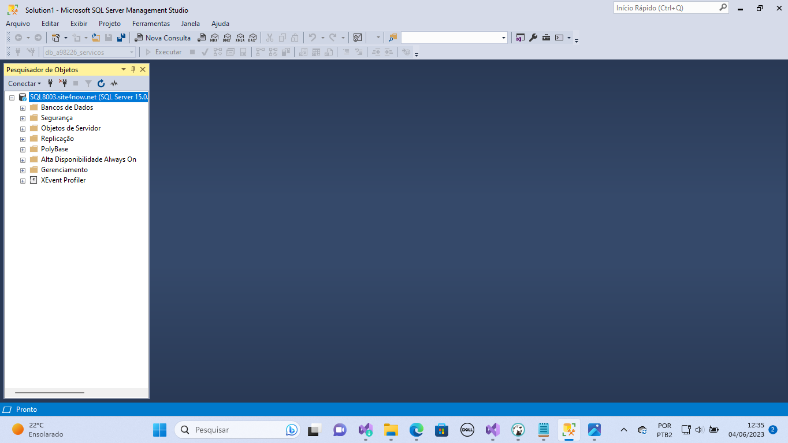

### Consulta banco de dados usuarios
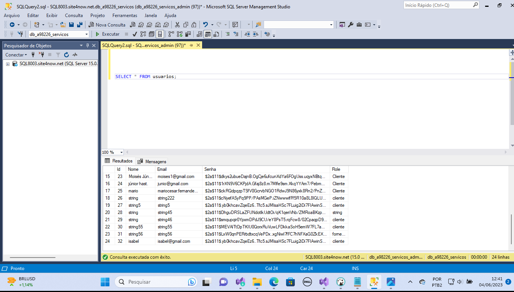

## Avaliação
Os casos de teste 003 - (Banco De Dados Criptografia Senha Usuarios) -  foram realizados com êxito, 
Com base nos resultados obtidos no teste realizado no banco de dados, podemos concluir que as senhas dos usuários estão devidamente criptografadas e protegidas. A implementação de medidas de segurança, como a escolha de algoritmos de criptografia confiáveis e a utilização de técnicas de salting, garante a integridade dos dados confidenciais e previne o acesso não autorizado.

