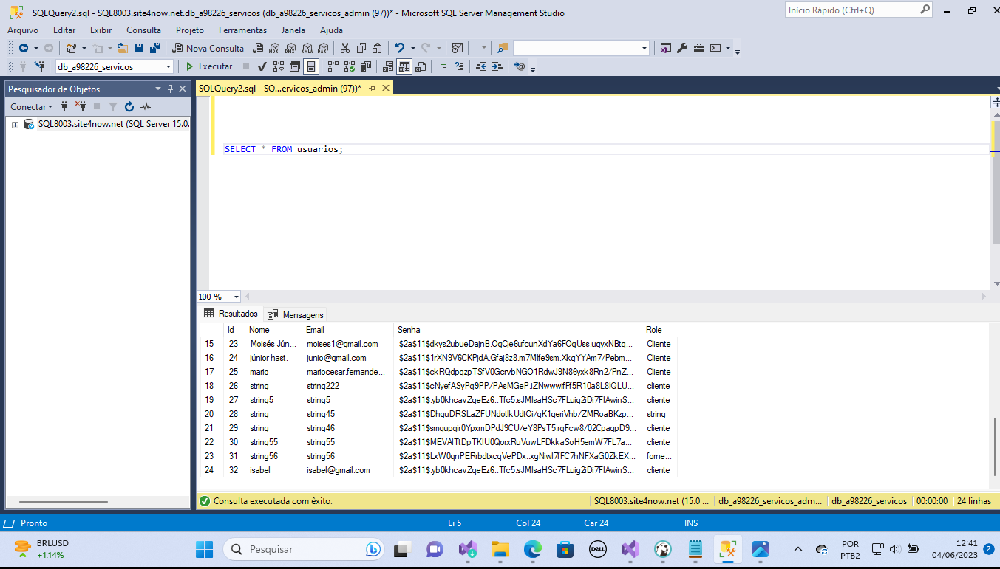

# Registro de testes te usabilidade
Pré-requisitos: <a href="2-Especificação do Projeto.md"> Especificação do Projeto</a>, <a href="3-Projeto de Interface.md"> Projeto de Interface</a>

Realização de testes com usuários definindo as operações que os usuários devem realizar.

|Caso de teste   | CTU -001 Usuários tendo interface intuitiva para realizar login e conhecer a plataforma.
|------|-----------------------------------------|
|Requisitos associados |RNF -001 o aplicativo deve ser fácil e intuitivo de usar, para que os usuários possam encontrar os serviços que precisam de forma rápida e eficiente.
|Objetivo do teste | Usuário com familiaridade com a plataforma.
|Conclusão | <ul><li>Usuário constantando interface intuitiva e com familiaridade para realizar o login.</li></ul>

|Caso de teste   | CTU - 002 - Aplicativo disponível 24 horas e 7 dias por semana 
|------|-----------------------------------------|
|Requisitos associados | RNF - 003 Confiabilidade: o aplicativo deve ser confiável e estar disponível 24 horas por dia, 7 dias por semana, para que os usuários possam acessá-lo sempre que precisarem.
|Objetivo do teste | Disponibilidade do aplicativo. 
|Conclusão | <ul><li>Aplicativo online e totalmente disponível para o usuário 24 horas por dia e nos 7 dias da semana. </li></ul>

|Caso de teste   | CTU - 003 - O aplicativo deve ser seguro e proteger as informações pessoais e financeiras dos usuários.
|------|-----------------------------------------|
|Requisitos associados |RNF -004 Segurança: o aplicativo deve ser seguro e proteger as informações pessoais e financeiras dos usuários.	
|Objetivo do teste | Garantir segurança dos dados dos usuários. 
|Conclusão | <ul><li>### Consulta banco de dados usuarios

Podemos concluir que as senhas dos usuários estão devidamente criptografadas e protegidas. A implementação de medidas de segurança, como a escolha de algoritmos de criptografia confiáveis e a utilização de técnicas de salting, garante a integridade dos dados confidenciais e previne o acesso não autorizado.Sistema protegendo dados dos usuários</li></ul>

|Caso de teste   | CTU - 004 - Teste de perfomance
|------|-----------------------------------------|
|Requisitos associados |RNF -005 Escalabilidade: o aplicativo deve ser capaz de lidar com um grande número de usuários e fornecedores de serviços, sem comprometer o desempenho e a usabilidade.	
|Objetivo do teste | Garantir perfomance da aplicação. 
|Conclusão | <ul><li>Sistema perfomando com alto número de usuários.</li></ul>

